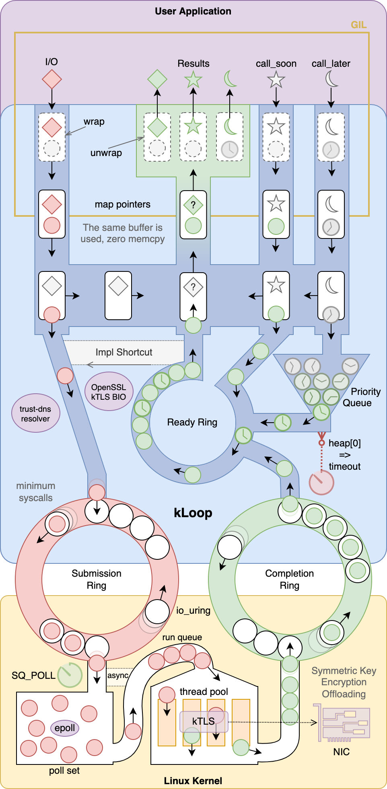

#   kLoop - *asyncio on Linux kernel*

[](README.zh.md)
[](https://github.com/fantix/kloop/actions/workflows/build.yml)
[](https://pypi.python.org/pypi/gino)
[](https://app.codacy.com/gh/fantix/kloop/dashboard)
[](http://license.coscl.org.cn/MulanPSL2/)

kLoop is an implementation of the Python
[asyncio](https://docs.python.org/3/library/asyncio.html) event loop written
in [Cython](https://cython.org/), using
[io_uring](https://unixism.net/loti/what_is_io_uring.html) and
[kTLS](https://www.kernel.org/doc/html/latest/networking/tls-offload.html)
features of the Linux kernel, therefore called k(ernel)Loop.

kLoop is open-sourced and released under the
[MulanPSL - 2.0 license](http://license.coscl.org.cn/MulanPSL2).

**⚠️WARNING: THIS PROJECT IS IN PROOF-OF-CONCEPT STAGE!⚠️**


## Features

* **Minimum syscalls** - all I/O calls are done in the kernel thanks to
  io_uring, and the only remaining syscall to `io_uring_enter()` is also
  optimized to be only called when necessary using the `SQPOLL` feature. That
  means most of the overhead of syscalls is gone;
* **No GIL in the main-loop** - the hot-path is written in Cython without GIL,
  that means it's compiled into pure C code without Python structures, saving
  some memory and execution time. On the other hand, GIL is only taken before
  Python callbacks, so it's slightly more friendly to multithreading, which is
  still not recommended though.
* **TLS offloading** - all symmetric-key encryption and decryption work is
  offloaded to the NIC if supported, or to the thread pool of io_uring
  otherwise. This allows us to free up CPU for more I/O, or leverage all the
  CPU cores even if the application is running single-threaded.
* **Asynchronous DNS resolving** - we blended in the Rust
  [trust-dns](https://github.com/bluejekyll/trust-dns/) library with a custom
  I/O runtime bridging to io_uring in C (including reading the
  `/etc/resolv.conf` and `/etc/hosts` files), providing flexible APIs to manage
  the concurrency, cache and configuration in Python.


## Requirements

* Python >= 3.10
* Linux >= 5.11 (enable kTLS with `modprobe tls`)
* OpenSSL >= 3.0 (kTLS receive offloading requires the latest development
  version)

Development and testing is done on Ubuntu 22.04.


## Architecture Diagram



Looks like the Lucky Charms factory, says @aaronbrighton ...


## Development

### Ubuntu 22.04

```bash
sudo apt update
sudo apt install gcc libssl-dev python3-dev python3.10-venv
curl --proto '=https' --tlsv1.2 -sSf https://sh.rustup.rs | sh
python3 -m venv path/to/env
source path/to/env/bin/activate
pip install -e path/to/kloop
```
