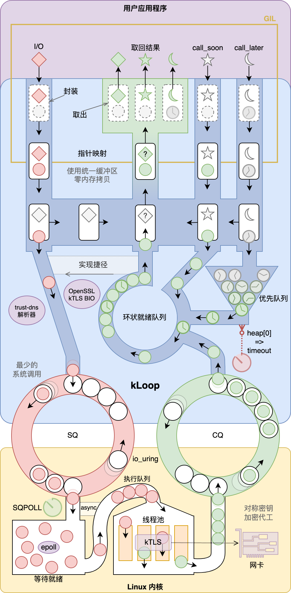

# kLoop：*Linux 内核上的 asyncio* 

[](README.md)
[](https://github.com/fantix/kloop/actions/workflows/build.yml)
[](https://pypi.python.org/pypi/gino)
[](https://app.codacy.com/gh/fantix/kloop/dashboard)
[](http://license.coscl.org.cn/MulanPSL2/)

kLoop 是一个 Python
[asyncio](https://docs.python.org/3/library/asyncio.html)
事件循环的实现，主要用 [Cython](https://cython.org/) 编写，重点使用了 Linux 内核的
[io_uring](https://unixism.net/loti/what_is_io_uring.html) 和
[kTLS](https://www.kernel.org/doc/html/latest/networking/tls-offload.html)
功能，故称作 k(ernel)Loop。

您可在[木兰宽松许可证, 第2版](http://license.coscl.org.cn/MulanPSL2)允许的范围内使用
kLoop 的源代码或发行版。

**⚠️警告：项目仍在概念验证当中，满地都是坑！⚠️**


## 主要特性

* **系统调用次数非常少**：得益于 io_uring，所有 I/O 调用都由内核完成；因为启用了
  `SQPOLL`，唯一的系统调用 `io_uring_enter()`
  也仅在必要时才会用到，因此节省下了几乎所有系统调用的额外开销；
* **主循环主体不占有 GIL**：虽然使用了 Cython 编写，但大部分最核心的代码都被编译为不需要
  Python 结构的普通 C 代码，一方面节省内存开销和处理时间，另一方面不持有 GIL，仅在有
  Python 回调时才上 GIL 锁，对多线程稍微友好一点，但还是推荐单线程跑；
* **内核网卡代工 TLS**：如果硬件支持，TLS 通讯的全部对称加密解密皆由网卡完成，空出 CPU
  来做更多的 I/O；即使网卡不支持，io_uring
  也可以在内核中开多线程来执行对称加解密，不受应用端单线程的限制，充分利用多核 CPU；
* **纯异步 DNS 解析**：混编进了 Rust 写的
  [trust-dns](https://github.com/bluejekyll/trust-dns/)，I/O 层直接走
  io_uring（包括加载 `/etc/resolv.conf` 和 `/etc/hosts` 文件），在 C 和 Rust
  之间互相调用完成 DNS 解析，并且提供了更加灵活的 Python 接口来控制并发、缓存和配置文件。


## 环境需求

* Python >= 3.10
* Linux >= 5.11 (用 `modprobe tls` 命令来启用 kTLS 模块)
* OpenSSL >= 3.0（支持 kTLS 收包代工需要最新的开发版本）

目前主要是在 Ubuntu 22.04 上开发测试的。


## 架构图



@aaronbrighton 说像 Lucky Charms 卡通麦片工厂……


## 开发

### Ubuntu 22.04

```bash
sudo apt update
sudo apt install gcc libssl-dev python3-dev python3.10-venv
curl --proto '=https' --tlsv1.2 -sSf https://sh.rustup.rs | sh
python3 -m venv path/to/env
source path/to/env/bin/activate
pip install -e path/to/kloop
```
